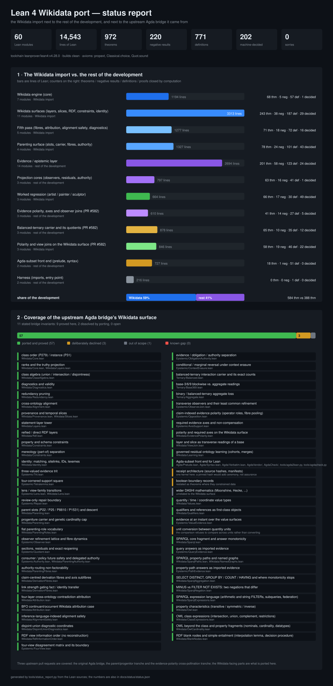

# Status report: the Lean 4 Wikidata import vs. the rest of the project



Two comparisons: **(1)** the Wikidata import against the rest of this Lean development, and **(2)** this port against the Wikidata surface of the upstream Agda bridge it was ported from. Every number in section 1 is counted from the Lean sources by `tools/status_report.py`; section 2 is transcribed from `PORTING_NOTES.md` and `RELATED_WORK.md`, and each 'ported' row names the module that carries it.

## At a glance

| | |
| --- | --- |
| Lean modules | 60 |
| Lines of Lean | 14,543 |
| Theorems | 972 |
| of which negative results (some inference is *not* licensed) | 220 |
| Definitions (`def` / `structure` / `inductive` / `instance`) | 771 |
| Theorems closed by computation (`decide`) | 202 |
| `sorry` | 0 |
| Toolchain | `leanprover/lean4:v4.28.0` |
| Axioms used | `propext`, `Classical.choice`, `Quot.sound` |

## 1 · The Wikidata import vs. the rest of the development

| Area | Side | Files | Lines | | Thm | Neg | Def | Decided |
| --- | --- | ---: | ---: | :-- | ---: | ---: | ---: | ---: |
| Wikidata engine (core) | Wikidata import | 7 | 1194 | `██████████··················` | 68 | 5 | 57 | 1 |
| Wikidata surfaces (layers, slices, RDF, constraints, identity) | Wikidata import | 11 | 3313 | `████████████████████████████` | 243 | 38 | 187 | 29 |
| Fifth pass (fibres, attribution, alignment safety, diagnostics) | Wikidata import | 5 | 1277 | `███████████·················` | 71 | 18 | 72 | 16 |
| Parenting surface (slots, carrier, fibres, authority) | Wikidata import | 4 | 1327 | `███████████·················` | 78 | 24 | 101 | 43 |
| Evidence / epistemic layer | rest | 14 | 2694 | `███████████████████████·····` | 201 | 58 | 123 | 24 |
| Projection cores (observers, residuals, authority) | rest | 3 | 797 | `███████·····················` | 63 | 16 | 41 | 1 |
| Worked regression (artist / painter / sculptor) | Wikidata import | 3 | 664 | `██████······················` | 66 | 17 | 30 | 49 |
| Evidence polarity, axes and observer joins (PR #582) | rest | 3 | 610 | `█████·······················` | 41 | 14 | 27 | 5 |
| Balanced-ternary carrier and its quotients (PR #582) | rest | 3 | 878 | `███████·····················` | 65 | 10 | 35 | 12 |
| Polarity and view joins on the Wikidata surface (PR #582) | Wikidata import | 3 | 846 | `███████·····················` | 58 | 19 | 46 | 22 |
| Agda-subset front end (prelude, syntax) | rest | 2 | 727 | `██████······················` | 18 | 1 | 51 | 0 |
| Harness (imports, entry point) | rest | 2 | 216 | `██··························` | 0 | 0 | 1 | 0 |
| **total** | | **60** | **14543** | | **972** | **220** | **771** | **202** |

| Side | Files | Lines | Share | Thm | Neg | Def | Decided |
| --- | ---: | ---: | ---: | ---: | ---: | ---: | ---: |
| Wikidata import (`RequestProject/Wikidata`) | 33 | 8621 | 59% | 584 | 121 | 493 | 160 |
| Rest (evidence layer + harness) | 27 | 5922 | 41% | 388 | 99 | 278 | 42 |

What the split says:

* The ontology side is the larger half — 59% of the lines and 584 of the 972 theorems — because the port rebuilt an executable engine underneath the imported discipline rather than recording it.
* Negative results are concentrated in the evidence layer (58 of 201 theorems there, vs. 5 of 68 in the core engine): stating what an import does *not* license is the part inherited from the source bridge.
* The regression modules are almost entirely machine-decided (49 of 66 theorems closed by `decide`), so the worked fragment is run through the real checkers rather than asserted.

## 2 · Coverage of the upstream Agda bridge's Wikidata surface

The source states its discipline as **11 invariants**: 9 are proved here as theorems, 2 dissolve on porting (the results live in the same kernel as their consumers, and the worked fragment is decided by the real checkers), 0 remain open. The invariant-by-invariant table is in `RELATED_WORK.md` §1.2.

Surface-by-surface: **57** ported and proved, **3** deliberately declined, **1** out of scope, **0** known gap.

| Surface | Status | Where / why |
| --- | --- | --- |
| class order (P279) / instance (P31) | ✅ ported and proved | `RequestProject/Wikidata/Core.lean` |
| ranks and the truthy projection | ✅ ported and proved | `RequestProject/Wikidata/Core.lean`, `RequestProject/Wikidata/Layers.lean` |
| class algebra (union / intersection / disjointness) | ✅ ported and proved | `RequestProject/Wikidata/ClassAlgebra.lean` |
| diagnostics and validity | ✅ ported and proved | `RequestProject/Wikidata/Diagnostics.lean` |
| redundancy pruning | ✅ ported and proved | `RequestProject/Wikidata/Redundancy.lean` |
| cross-ontology alignment | ✅ ported and proved | `RequestProject/Wikidata/Alignment.lean` |
| provenance and temporal slices | ✅ ported and proved | `RequestProject/Wikidata/Provenance.lean`, `RequestProject/Wikidata/Slices.lean` |
| statement-layer tower | ✅ ported and proved | `RequestProject/Wikidata/Layers.lean` |
| reified / direct RDF layers | ✅ ported and proved | `RequestProject/Wikidata/Rdf.lean` |
| property and schema constraints | ✅ ported and proved | `RequestProject/Wikidata/Constraints.lean` |
| mereology (part-of) separation | ✅ ported and proved | `RequestProject/Wikidata/Constraints.lean` |
| identity: matching, sitelinks, IDs, lexemes | ✅ ported and proved | `RequestProject/Wikidata/Identity.lean` |
| three-valued evidence trit | ✅ ported and proved | `RequestProject/Epistemic/Trit.lean` |
| four-cornered support square | ✅ ported and proved | `RequestProject/Epistemic/Tetralemma.lean` |
| lens / view-family transitions | ✅ ported and proved | `RequestProject/Epistemic/Lens.lean`, `RequestProject/Wikidata/Lens.lean` |
| review-only repair boundary | ✅ ported and proved | `RequestProject/Epistemic/Repair.lean` |
| parent slots (P22 / P25 / P8810 / P1531) and descent | ✅ ported and proved | `RequestProject/Wikidata/Parenting.lean` |
| progeniture carrier and genetic cardinality cap | ✅ ported and proved | `RequestProject/Wikidata/Parenting.lean` |
| flat parenting-role vocabulary | ✅ ported and proved | `RequestProject/Wikidata/ParentingRoles.lean` |
| observer refinement lattice and fibre dynamics | ✅ ported and proved | `RequestProject/Epistemic/Observer.lean` |
| sections, residuals and exact reopening | ✅ ported and proved | `RequestProject/Epistemic/Quotient.lean` |
| consumer / policy future safety and delegated authority | ✅ ported and proved | `RequestProject/Epistemic/Authority.lean`, `RequestProject/Wikidata/ParentingAuthority.lean` |
| authority-routing non-factorability | ✅ ported and proved | `RequestProject/Wikidata/ParentingFibres.lean` |
| claim-centred derivation fibres and axis subfibres | ✅ ported and proved | `RequestProject/Wikidata/DerivationFibres.lean` |
| link strength gating fact / identity transfer | ✅ ported and proved | `RequestProject/Wikidata/DerivationFibres.lean` |
| four-layer cross-ontology contradiction attribution | ✅ ported and proved | `RequestProject/Wikidata/Attribution.lean` |
| BFO continuant/occurrent Wikidata attribution case | ✅ ported and proved | `RequestProject/Wikidata/Attribution.lean` |
| inference-language-indexed alignment safety | ✅ ported and proved | `RequestProject/Wikidata/AlignmentSafety.lean` |
| disjoint-union diagnostic coordinates | ✅ ported and proved | `RequestProject/Wikidata/DisjointUnionDiagnostics.lean` |
| RDF view information order (no reconstruction) | ✅ ported and proved | `RequestProject/Wikidata/RdfInformationOrder.lean` |
| four-view disagreement matrix and its boundary | ✅ ported and proved | `RequestProject/Epistemic/FourView.lean` |
| evidence / obligation / authority separation | ✅ ported and proved | `RequestProject/Epistemic/ObligationAuthority.lean` |
| conditional / marginal reversal under context erasure | ✅ ported and proved | `RequestProject/Epistemic/ContextErasure.lean` |
| balanced-ternary interaction carrier and its exact counts | ✅ ported and proved | `RequestProject/Ternary/Balanced.lean` |
| base-3/6/9 blockwise vs. aggregate readings | ✅ ported and proved | `RequestProject/Ternary/Base369.lean` |
| binary / balanced-ternary aggregate loss | ✅ ported and proved | `RequestProject/Ternary/Aggregate.lean` |
| transverse observers and their least common refinement | ✅ ported and proved | `RequestProject/Epistemic/ObserverJoin.lean` |
| claim-indexed evidence polarity (operator roles, fibre pooling) | ✅ ported and proved | `RequestProject/Epistemic/Opposition.lean` |
| required evidence axes and non-compensation | ✅ ported and proved | `RequestProject/Epistemic/AxisSupport.lean` |
| polarity and required axes on the Wikidata surface | ✅ ported and proved | `RequestProject/Wikidata/EvidencePolarity.lean` |
| layer and slice as transverse readings of a base | ✅ ported and proved | `RequestProject/Wikidata/ViewJoin.lean` |
| governed residual ontology learning (cohorts, merges) | ✅ ported and proved | `RequestProject/Wikidata/Learning.lean` |
| Agda-subset front end for Lean | ✅ ported and proved | `RequestProject/Agda/Prelude.lean`, `RequestProject/Agda/Syntax.lean`, `RequestProject/Agda/Verbatim.lean`, `RequestProject/AgdaVendor/`, `RequestProject/AgdaCheck/`, `RequestProject/tools/agda2lean.py`, `RequestProject/tools/agdacheck.py` |
| receipt architecture (source hashes, manifests) | ⚠️ deliberately declined | one kernel here: a pinned hash would add ceremony, not assurance |
| boolean boundary records | ⚠️ deliberately declined | restated as theorems where they constrained data |
| wider DASHI mathematics (Moonshine, Hecke, ...) | ⬜ out of scope | unrelated to the Wikidata surface |
| quantity / time / coordinate value types | ✅ ported and proved | `RequestProject/Wikidata/Values.lean` |
| qualifiers and references as first-class objects | ✅ ported and proved | `RequestProject/Wikidata/Qualifiers.lean` |
| evidence at an instant over the value surfaces | ✅ ported and proved | `RequestProject/Epistemic/ValueEvidence.lean` |
| unit conversion between quantity units | ⚠️ deliberately declined | the comparison refuses to compare across units rather than converting |
| SPARQL core fragment and answer monotonicity | ✅ ported and proved | `RequestProject/Wikidata/Sparql.lean` |
| query answers as imported evidence | ✅ ported and proved | `RequestProject/Epistemic/QueryEvidence.lean` |
| SPARQL property paths and named graphs | ✅ ported and proved | `RequestProject/Wikidata/SparqlPaths.lean`, `RequestProject/Wikidata/NamedGraphs.lean` |
| property-path answers as imported evidence | ✅ ported and proved | `RequestProject/Epistemic/PathEvidence.lean` |
| SELECT DISTINCT, GROUP BY / COUNT / HAVING and where monotonicity stops | ✅ ported and proved | `RequestProject/Wikidata/SparqlAggregation.lean` |
| MINUS vs FILTER NOT EXISTS: two negations that differ | ✅ ported and proved | `RequestProject/Wikidata/SparqlNegation.lean` |
| SPARQL expression language (arithmetic and string FILTERs, subqueries, federation) | ✅ ported and proved | `RequestProject/Wikidata/SparqlExpressions.lean` |
| property characteristics (transitive / symmetric / inverse) | ✅ ported and proved | `RequestProject/Wikidata/Owl.lean` |
| OWL class expressions (intersection, union, complement, restrictions) | ✅ ported and proved | `RequestProject/Wikidata/ClassExpressions.lean` |
| OWL beyond the class and property fragments (nominals, cardinality, datatypes) | ✅ ported and proved | `RequestProject/Wikidata/OwlCardinality.lean` |
| RDF blank nodes and simple entailment (interpolation lemma, decision procedure) | ✅ ported and proved | `RequestProject/Wikidata/BlankNodes.lean` |

*Three upstream pull requests are covered: the original Agda bridge, the parent/progenitor tranche and the evidence-polarity cross-pollination tranche; the Wikidata-facing parts are what is ported here.*

## Appendix · per-module figures

| Module | Lines | Thm | Neg | Def | Decided |
| --- | ---: | ---: | ---: | ---: | ---: |
| `RequestProject/Wikidata/Reachability.lean` | 233 | 8 | 0 | 4 | 0 |
| `RequestProject/Wikidata/Core.lean` | 225 | 12 | 2 | 23 | 0 |
| `RequestProject/Wikidata/ClassAlgebra.lean` | 167 | 10 | 1 | 9 | 0 |
| `RequestProject/Wikidata/Redundancy.lean` | 152 | 12 | 2 | 3 | 1 |
| `RequestProject/Wikidata/Diagnostics.lean` | 105 | 3 | 0 | 5 | 0 |
| `RequestProject/Wikidata/Alignment.lean` | 111 | 4 | 0 | 6 | 0 |
| `RequestProject/Wikidata/Provenance.lean` | 201 | 19 | 0 | 7 | 0 |
| `RequestProject/Wikidata/Slices.lean` | 151 | 23 | 0 | 3 | 0 |
| `RequestProject/Wikidata/Layers.lean` | 198 | 22 | 1 | 3 | 1 |
| `RequestProject/Wikidata/Rdf.lean` | 334 | 20 | 3 | 13 | 2 |
| `RequestProject/Wikidata/Constraints.lean` | 326 | 25 | 6 | 25 | 2 |
| `RequestProject/Wikidata/Identity.lean` | 252 | 15 | 2 | 12 | 2 |
| `RequestProject/Wikidata/Lens.lean` | 138 | 13 | 3 | 4 | 0 |
| `RequestProject/Wikidata/Values.lean` | 420 | 37 | 9 | 29 | 4 |
| `RequestProject/Wikidata/Qualifiers.lean` | 409 | 25 | 5 | 26 | 5 |
| `RequestProject/Wikidata/Sparql.lean` | 314 | 16 | 4 | 23 | 8 |
| `RequestProject/Wikidata/Owl.lean` | 203 | 11 | 3 | 18 | 5 |
| `RequestProject/Wikidata/BlankNodes.lean` | 568 | 36 | 2 | 31 | 0 |
| `RequestProject/Wikidata/DerivationFibres.lean` | 386 | 23 | 5 | 24 | 2 |
| `RequestProject/Wikidata/Attribution.lean` | 391 | 21 | 4 | 21 | 5 |
| `RequestProject/Wikidata/AlignmentSafety.lean` | 186 | 11 | 5 | 11 | 2 |
| `RequestProject/Wikidata/DisjointUnionDiagnostics.lean` | 189 | 9 | 1 | 11 | 6 |
| `RequestProject/Wikidata/RdfInformationOrder.lean` | 125 | 7 | 3 | 5 | 1 |
| `RequestProject/Wikidata/Parenting.lean` | 591 | 29 | 10 | 58 | 16 |
| `RequestProject/Wikidata/ParentingRoles.lean` | 155 | 8 | 1 | 8 | 7 |
| `RequestProject/Wikidata/ParentingFibres.lean` | 331 | 24 | 8 | 22 | 11 |
| `RequestProject/Wikidata/ParentingAuthority.lean` | 250 | 17 | 5 | 13 | 9 |
| `RequestProject/Epistemic/Trit.lean` | 269 | 34 | 7 | 12 | 0 |
| `RequestProject/Epistemic/Bridge.lean` | 243 | 16 | 6 | 12 | 0 |
| `RequestProject/Epistemic/Repair.lean` | 164 | 10 | 1 | 6 | 0 |
| `RequestProject/Epistemic/Context.lean` | 78 | 6 | 1 | 1 | 0 |
| `RequestProject/Epistemic/Surfaces.lean` | 189 | 13 | 4 | 8 | 0 |
| `RequestProject/Epistemic/ValueEvidence.lean` | 182 | 11 | 5 | 6 | 2 |
| `RequestProject/Epistemic/QueryEvidence.lean` | 98 | 6 | 2 | 3 | 1 |
| `RequestProject/Epistemic/Views.lean` | 192 | 17 | 3 | 6 | 1 |
| `RequestProject/Epistemic/Tetralemma.lean` | 325 | 33 | 5 | 16 | 2 |
| `RequestProject/Epistemic/Lens.lean` | 187 | 13 | 6 | 10 | 1 |
| `RequestProject/Epistemic/ParentingEvidence.lean` | 165 | 10 | 6 | 6 | 3 |
| `RequestProject/Epistemic/FourView.lean` | 257 | 12 | 6 | 18 | 8 |
| `RequestProject/Epistemic/ObligationAuthority.lean` | 161 | 11 | 4 | 8 | 3 |
| `RequestProject/Epistemic/ContextErasure.lean` | 184 | 9 | 2 | 11 | 3 |
| `RequestProject/Epistemic/Observer.lean` | 259 | 27 | 6 | 14 | 0 |
| `RequestProject/Epistemic/Quotient.lean` | 231 | 15 | 3 | 12 | 0 |
| `RequestProject/Epistemic/Authority.lean` | 307 | 21 | 7 | 15 | 1 |
| `RequestProject/Wikidata/Examples.lean` | 307 | 30 | 8 | 17 | 21 |
| `RequestProject/Wikidata/ExamplesLayers.lean` | 215 | 24 | 8 | 8 | 19 |
| `RequestProject/Wikidata/ExamplesConflict.lean` | 142 | 12 | 1 | 5 | 9 |
| `RequestProject/Epistemic/ObserverJoin.lean` | 117 | 9 | 1 | 1 | 0 |
| `RequestProject/Epistemic/Opposition.lean` | 297 | 16 | 6 | 15 | 1 |
| `RequestProject/Epistemic/AxisSupport.lean` | 196 | 16 | 7 | 11 | 4 |
| `RequestProject/Ternary/Balanced.lean` | 357 | 24 | 1 | 10 | 2 |
| `RequestProject/Ternary/Base369.lean` | 325 | 25 | 5 | 14 | 2 |
| `RequestProject/Ternary/Aggregate.lean` | 196 | 16 | 4 | 11 | 8 |
| `RequestProject/Wikidata/EvidencePolarity.lean` | 216 | 15 | 5 | 8 | 8 |
| `RequestProject/Wikidata/ViewJoin.lean` | 130 | 9 | 1 | 11 | 5 |
| `RequestProject/Wikidata/Learning.lean` | 500 | 34 | 13 | 27 | 9 |
| `RequestProject/Agda/Prelude.lean` | 335 | 18 | 1 | 39 | 0 |
| `RequestProject/Agda/Syntax.lean` | 392 | 0 | 0 | 12 | 0 |
| `RequestProject/All.lean` | 192 | 0 | 0 | 1 | 0 |
| `RequestProject/Main.lean` | 24 | 0 | 0 | 0 | 0 |

## Regenerating

```
python3 tools/status_report.py    # rewrites status.json, status.svg and STATUS_REPORT.md
```

Counting conventions: 'negative results' are theorems whose name carries a negative token (`not`, `ne`, `never`, `no`, `forgets`, `inert`, `irrelevant`, `lossy`) — i.e. it states a disequality or that some inference is not licensed; 'decided' counts theorems whose proof invokes `decide`. The raw numbers, including the list of negative-result names per module, are in `status.json`.
