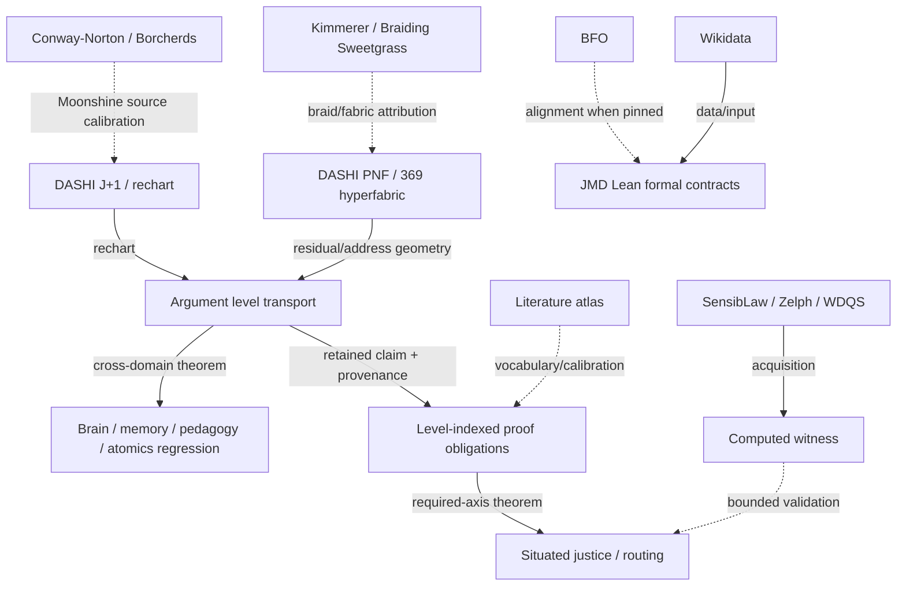

# Argument-level 369 / fibre / J+1 hyperformalism weld

This tranche makes an existing DASHI mathematical spine explicit instead of treating `369`, fibres, hypervoxels, J+1, Moonshine, PNF residuals, learning and governance as unrelated metaphors.

The central invariant is:

```text
retain the whole typed carrier and provenance
  -> inspect/project at the current level
  -> keep local evidence and local applicability separate
  -> retain residual/obstruction instead of erasing it
  -> re-open, re-role or re-chart when a richer comparison is admitted
  -> never promote a useful projection into identity or authority.
```

## 1. Argument transport is level-indexed

`DASHI.Core.ArgumentLevelTransportHyperformalismExact` builds directly on:

- `ArgumentObstructionCore` — an obstruction blocks one transport route; it does not prove the target conclusion false;
- `InspectionRelativeNoTypedMeet` — `NO_TYPED_MEET` is relative to the current inspection and may be revised by deeper parsing, an explicit bridge, or a new role assignment;
- `PNFVoidScopeBoundary` — same-fibre `NO_TYPED_MEET`, outside-comparison `SCOPE_EXCEEDED`, and projection-collapse scope loss remain distinct;
- `ReopenableEvidenceFibre` / `ProvenanceBearingQuotient` — projection residual is not semantic erasure.

The new carrier is:

```text
SituatedArgument Whole Level Provenance
```

and a `LevelTransport` proves that `Whole` and `Provenance` are retained while the current level may change.

`ArgumentStalk` adds two *local* coordinates:

```text
SupportSquare × Applicability
```

where applicability can be:

```text
applicable here
no typed meet at this level
outside current comparison scope
projection collapsed a required coordinate.
```

Consequently the same positive evidence can occur at two levels while one level can decide and the other must re-chart.

## 2. Support is not applicability

`DASHI.Core.LevelIndexedProofObligationHyperformalismExact` proves a concrete collision:

```text
same SupportSquare = (true,false)
different Applicability
=> no function of SupportSquare alone can reconstruct applicability.
```

It then reuses `IntersectionalNonFactorability` to prove the action-facing version:

```text
same flat evidence
different level-aware decision
=> no reinterpretation/reweighting on the flat evidence carrier
   recovers the fine decision.
```

This is intersectional non-factorability in proof/inspection space.

## 3. 369 is both address geometry and a typed refinement family

The existing `PNFHyperfabric369` exact arithmetic remains:

```text
3 * 3       = 9
9 ^ 2       = 81
3 * 3 * 3   = 27
```

with document time adding a hypervoxel/hyperfabric axis.

The stronger existing `SSPPrimeLane369DepthWheelCantorBridge` gives typed fibres:

```text
3 = depth phase
6 = polar trit × depth phase
9 = full trit × depth phase.
```

The canonical information direction is:

```text
6 -> 9 -> 3
```

because the polar carrier embeds into the full carrier and then state may be forgotten.  There is deliberately no canonical `9 -> 6` retraction without an additional policy for the zero trit.

`SSPPrimeLane369Refinement` additionally retains the explicit recursive address:

```text
[3,6,9]
```

whose prefix is `[3,6]`.  Refinement therefore has retained history, rather than being merely a numerological label.

## 4. Carry and J+1

`CarryMemorySubvoxelReceipt` records the balanced-ternary bookkeeping shape:

```text
+1_k + +1_k
= -1_k locally
+ a +1 carry at k+1.
```

The lower `-1_k` residue persists as subvoxel memory.  The safe evaluator reads `j` and `j+1` together rather than dropping the carry.

`TriadicResidualRechartDynamics` supplies the complementary model-selection law:

```text
gluing failure residual -> rechart model
chart 10 -> chart 11.
```

Not every residual triggers a rechart; the action is residual-kind indexed.

`JChartSuccessorBoundary` keeps three uses of `j` distinct:

```text
chart j != modular j != representation/spin j.
```

## 5. Monster / McKay is an exact separate +1 exemplar

`JPlusOneScaleBridge` imports the repository's exact McKay arithmetic:

```text
196883 + 1 = 196884.
```

The broad bridge records this and `10 + 1 = 11` as instances of a common `FreshUnitExtension` shape.

It simultaneously proves/records:

```text
common extension shape = true
values identified       = false
semantics identified    = false.
```

Source calibration already carried in the Agda:

- John H. Conway and Simon P. Norton, *Monstrous Moonshine*, BLMS 11 (1979), DOI `10.1112/blms/11.3.308`;
- Richard E. Borcherds, *Monstrous Moonshine and Monstrous Lie Superalgebras*, Invent. Math. 109 (1992), DOI `10.1007/BF01232032`.

## 6. Tesla boundary

`TeslaPolyphaseHistoricalBoundary` is retained exactly.

Tesla's periodic, rotating-field and polyphase engineering may motivate a phase/periodicity bridge.  The repository does **not** attribute to Tesla:

```text
Base369
p-adic refinement towers
character/irrep machinery
MDL machinery
Eisenstein/modular-j/Monster mathematics
or a universal 3-6-9 doctrine.
```

`JPlusOne369FibreCarryHyperformalismExact` therefore uses Tesla only through that explicit historical boundary.

## 7. BT-braid / adic hypervoxel geometry

`HypervoxelAdicYoungFibonacciBridge` already models refinement by a BT-braid strand:

```text
source(strand) = chart(current cell)
target(strand) = chart(refined cell).
```

Its relation to the Young-Fibonacci surface is explicitly `projectedShadow`, not `definitionalIdentity`.

`AdicHypervoxelArgumentTransportBridgeExact` exposes that theorem as the geometric analogue of the argument-level rule:

```text
refinement/transport can be exact
without making the projected view identical to the fine carrier.
```

No semantic argument is identified with an adic point.

## 8. Learning / memory / brain / atomics are adversarial instances

`CrossDomainLevelTransportRegression` tests the shared shape on unrelated carriers.

### Memory

`DepthWheelMemoryHyperfabric` proves:

```text
learning depth -> learning depth + 1
remembered public PNF remains unchanged.
```

One complete three-phase learning wheel advances depth by three and returns to the same depth-wheel phase while retaining the remembered PNF.

Empirical motivation in that source remains bounded:

- Nader, Schafe & LeDoux (2000), DOI `10.1038/35021052`;
- Bouton (2004), DOI `10.1101/lm.78804`;
- Schiller et al. (2010), DOI `10.1038/nature08637`.

These sources do not convert the abstract C3 grading into a clinical theorem.

### Brain

`BrainInvariantDepth` proves that its declared coarse depth invariant survives both summary and extraction.

This does **not** imply summary/extraction reconstruct the full brain state.  It is an exact example of:

```text
invariant preservation != representation completeness.
```

### Pedagogy

`PedagogicalJPlusOneRouting` uses J+1 as reviewed residual routing.  Human interpretation, student choice, opt-out and evidence return are required; model output is not an automatic intervention or diagnosis.

### Atomics / chemistry

`AtomicGenerationPipelineExact` separates typed stages from nuclear charge through observable prediction.  Enumerating labelled nuclear charges remains a finite analogue while solving the declared Hamiltonian and quantitative observable prediction remain externally open.

So:

```text
success at an earlier proof-obligation level
!= discharge of a later level.
```

## 9. Authority-routing instance

`ArgumentLevelAuthorityRoutingExact` distinguishes two failure modes that a flat route gate can easily collapse:

```text
missing current-authority evidence
!=
positive evidence whose authority question is outside this inspection level.
```

The second case can be transported from an incident/intake level to a mandate-review level while preserving the same claim and provenance.  Positive evidence does not self-promote through the applicability boundary.

## 10. Typed provenance dependency graph / infographic

`TypedProvenanceDependencyGraphExact` separates source family from dependency role.

Source families include:

```text
DASHI formal
Wikidata data
JMD Lean formal
BFO ontology
scholarly literature
empirical dataset
computed witness
community/cultural source
runtime acquisition.
```

Dependency roles include definition, theorem, evidence, vocabulary, projection, reconstruction, residual, rechart, counterexample, alignment, acquisition, authority-boundary and validation roles.

`BroadMathProvenanceDependencyGraphExact` instantiates a bounded 13-node / 11-edge map.  The count is descriptive provenance load only; it is explicitly not a truth or ownership percentage.



The graph is intentionally heterogeneous: a dotted/contextual dependency does not silently become a theorem premise.

## 11. Sweetgrass attribution

The existing `SweetgrassCarrierSpine` credits Robin Wall Kimmerer and *Braiding Sweetgrass* for braid/fabric interpretive vocabulary.  The source is represented in the new source atlas as:

- Robin Wall Kimmerer, *Braiding Sweetgrass: Indigenous Wisdom, Scientific Knowledge, and the Teachings of Plants*, Milkweed Editions (2013); no DOI asserted by this atlas; Wikidata item `Q85748689` is retained as a public identifier.

The book is not treated as proof authority for fibre products, sheaves, category theory, PNF, or hyperfabric mathematics.

## Compact theorem picture

The new common spine is:

```text
whole typed carrier + provenance
        |
        v
current chart / fibre / observer / role
        |
        +---- local support / counter-support
        |
        +---- local applicability / typed-meet / scope
        |
        +---- residual / obstruction / carry
        |
        v
retain / reopen / refine / braid / rechart at j+1
        |
        v
new local surface, same retained provenance chain.
```

And the central anti-collapse laws are:

```text
same evidence != same applicability
NO_TYPED_MEET here != false everywhere
SCOPE_EXCEEDED != argument erasure
projection residual != semantic erasure
preserved invariant != full-state identity
3/6/9 address != exhaustive semantic ontology
6 -> 9 does not imply policy-free 9 -> 6
J+1 chart != modular j != representation j
McKay +1 != chart-carrier identity
Tesla polyphase context != ownership of modern DASHI 369 mathematics
shared braid/fabric vocabulary != domain identity
source count != truth percentage.
```

Focused validation root:

```text
DASHI/EverythingArgumentLevel369Hyperformalism.agda
```

Focused theorem regression:

```text
DASHI/Governance/ArgumentHyperformalism369Regression.agda
```

No external source, metaphor, runtime diagnostic or projection is promoted beyond the explicit proof/authority boundaries of its owning module.
