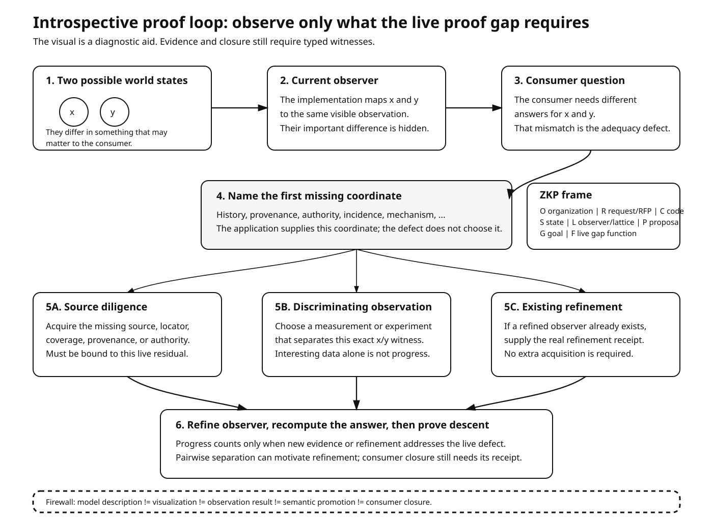

# Introspective proof loop

This note explains the repository-native introspective method used to inspect and improve proof-search and observation code without turning explanation into evidence.

The formal owner is [`../DASHI/Interop/IntrospectiveProofLoopExact.agda`](../DASHI/Interop/IntrospectiveProofLoopExact.agda). It sits above the existing consumer-fibre scheduler and proof-search/experiment junction rather than replacing either one.

## Plain-language model

Suppose two possible world states, `x` and `y`, look identical to the current observer. If a consumer would nevertheless need different answers for `x` and `y`, the current observer is not adequate for that consumer.

The next step is not automatically “run an experiment.” The application first names the missing coordinate: for example history, provenance, authority, incidence, mechanism, or another consumer-relevant distinction. The existing scheduler then identifies the corresponding producer class.

There are three legitimate ways forward:

1. acquire source/provenance evidence that pays the missing source coordinate;
2. run a discriminating observation or experiment that separates the concrete witness pair;
3. use an already-available refined observer and supply the real refinement receipt.

After any acquisition, the observer is refined, the consumer answer is recomputed, and closure is claimed only when the answer really descends through the refined observer.

## Finding from the visual review

The visualization made one asymmetry easy to see. The existing experimental route already carries the concrete consumer residual, while the source-reopening route can otherwise be constructed independently of that residual. The new formal owner therefore adds `ConsumerDefectSourceDemand`, which binds a source reopening to both the live missing coordinate and the scheduled producer.

The same owner also adds an explicit experiment binding so an experiment demand must refer to the same live residual being reviewed, not merely another defect for the same consumer.

## ZKP audit frame

Each inspected round may carry references for:

- **O** — organization;
- **R** — request/RFP;
- **C** — code;
- **S** — current state;
- **L** — observer/lattice;
- **P** — proposed next action;
- **G** — goal;
- **F** — live gap function.

These references are audit metadata only. They do not replace the formal carriers they point to.

## Invariants and boundaries

The round is acceptable only when the live residual remains explicit, the proposed route is bound to that residual, source acquisition and experimental observation stay distinct, and consumer closure still requires a real `ConsumerRefinementReceipt`.

The visualization is deliberately diagnostic. A clear diagram may reveal a mismatch, but visualization does not create evidence, semantic promotion, intervention authority, or consumer closure.

## Verification target

The narrow verification target is the new owner plus the interop aggregate:

- [`../DASHI/Interop/IntrospectiveProofLoopExact.agda`](../DASHI/Interop/IntrospectiveProofLoopExact.agda)
- [`../DASHI/Interop/Everything.agda`](../DASHI/Interop/Everything.agda)

Repository CI should remain narrow and newest-run-wins in accordance with [`.github/WORKFLOW_PHILOSOPHY.md`](../.github/WORKFLOW_PHILOSOPHY.md).
