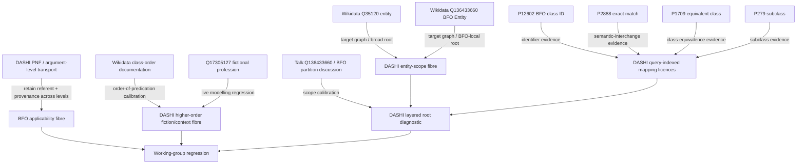

# Wikidata entity-scope provenance map

This bounded map records which source layer supplies which part of the current BFO/entity/higher-order-class handoff. It is descriptive provenance, not a percentage-of-truth metric.

## Layer roles

- **Wikidata items/properties** supply current target-graph assertions and public modelling vocabulary.
- **BFO/Wikidata project discussion** supplies current scope/alignment calibration, not DASHI theorem proofs.
- **DASHI** supplies non-reconstruction, nonfactorability, query-indexed inference, provenance-preserving level transport, and ambiguity/non-promotion theorems.
- **JMD Lean** remains available through `LeanWikidataEverything` for independently checked Wikidata class-algebra, alignment, diagnostics, and RDF contracts.

## Critical non-collapse rules

- label equality is not ontology identity;
- identifier agreement is not semantic equivalence;
- exact match and equivalent class are not interchangeable property roles;
- ambiguous mapping is not source-ontology contradiction;
- class order is not fictional/narrative status;
- member classes classifying fictional individuals does not make the metaclass an in-world fictional entity;
- not established / outside scope / conflicting derivations are distinct evaluation states;
- changing ontology inspection level does not erase the referent or its provenance.
