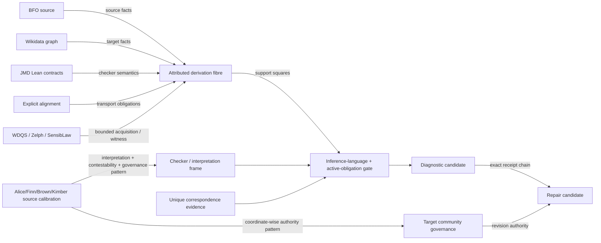

# Wikidata / JMD contradiction-attribution handoff

## Purpose

This is a deliberately small review surface for the Wikidata ontology working group and James Michael DuPont's Lean formalisation. It does **not** claim that DASHI, a Lean checker, SensibLaw, Zelph, WDQS, BFO, or any one participant is an oracle over Wikidata.

The outward contract is instead:

```text
pinned source ontology
  -> source/transcription correspondence
  -> explicit alignment
  -> target Wikidata graph
  -> declared inference language / checker frame
  -> provenance-bearing diagnostic
  -> contestable repair candidate
```

Every transition keeps the evidence needed to say what was checked, which layer contributed support or counter-support, what was missing, and who is authorised to revise which constitutive coordinate.

## Focused Agda roots

```text
DASHI/Ontology/WikidataWorkingGroupEverything.agda
DASHI/Ontology/WikidataWorkingGroupRegression.agda
```

The first imports the complete public surface; the second exercises the load-bearing negative and positive witnesses.

## What the package distinguishes

A structural red flag is not one untyped notion of failure. The attribution fibre keeps four primary layers separate:

```text
source ontology
source -> concrete transcription
cross-ontology alignment
target Wikidata graph
```

Support and counter-support remain independent coordinates. Thus simultaneous support and refutation is distinct from no evidence even though both can collapse to a coarse `unresolved` trit presentation.

The checker-result regression goes further: source failure, alignment failure, target failure and missing required evidence can all map to the same Boolean `false`. Therefore there is no exact decoder from a red/green checker bit back to the failure origin.

## Interpretation is part of the diagnostic

`WikidataInterpretiveDiagnosticExact` retains:

```text
source surface
snapshot
rule / coding frame
interpreter/checker
produced diagnostic
uncertainty receipt
missingness receipt
contestability route
```

A diagnostic is therefore a candidate interpretation under a declared frame, not semantic identity with the ontology.

This cross-pollinates a mature source-bound pattern from Alice Brown and collaborators without making the ontology mathematics depend on the Biology domain:

- Alice Brown and Megan Kimber, *Repositioning Student Voice and Agency: A Call for the Epistemic Expansion of Scholarship of Teaching and Learning Inquiry*, Active Learning in Higher Education 27(2), 253-264 (2026), DOI `10.1177/14697874261426374`.
- Roxanne Finn and Alice Brown, *Custodians of an ecology of data: Foundational theory and practice for data analysis in a complex world*, Qualitative Research 25(1), 110-129 (2025), DOI `10.1177/14687941241234293`.

The source papers motivate explicit interpretation, context, missingness, participant/collective contestability and coordinate-wise epistemic authority. The Agda ontology theorems are DASHI-local extensions.

## Detection does not confer edit authority

`WikidataDiagnosticGovernanceExact` uses the existing coordinate-wise `EpistemicInquiryGovernance` core.

The source-ontology maintainer may have constitutive authority over source carrier/question coordinates. The target ontology community may govern target projection, residual policy and revision. A formal checker or diagnostic analyst can supply evidence while having **no automatic constitutive authority** over those coordinates.

Hence:

```text
diagnostic finding != ontology truth
repair recommendation != edit mandate
having supplied evidence != authority to define the mapping
```

The edit/revision path requires its own governance witness.

## Full disjoint-union semantics

The JMD source-pinned contract `Wikidata.dunOk_iff` is represented directly. For a finite known KB, a declared disjoint union requires three independently diagnosable obligations:

```text
1. each component is under the holder class;
2. every known holder instance is covered by at least one component;
3. distinct components are pairwise disjoint.
```

This gives independent countermodels for:

```text
component-not-subclass
known-instance coverage / exhaustivity failure
pairwise overlap
```

The exhaustivity claim is deliberately scoped to the known finite KB carrier; it is not a closed-world metaphysical assertion about all possible instances.

## Inference-language-indexed alignment

A mapping can be adequate for one operation and inadequate for another. The public alignment profile separates:

```text
subclass reasoning
instance transport
disjointness reasoning
disjoint-union reasoning
```

The canonical countermodel passes the subclass language while failing the disjointness language. This is the ontology instance of the broader DASHI rule that a surface value does not provide its own interpretation licence.

The same general structure is formalised by `IndexedInterpretationMorphismExact`: operator, context, query and semantic role are part of the interpretation index. Equality under one index cannot be transported to every other index without an explicit theorem.

## Active obligations are stratified

`ActiveObligationEvidenceFibreExact` makes required evidence state/query dependent. An identifier-only use activates fewer obligations than subclass transport; disjointness transport activates another coordinate again.

Schematically:

```text
identifier query       -> {identifier}
subclass query         -> {identifier, subclass}
disjointness query     -> {identifier, subclass, disjointness}
```

An inactive axis is not a failed obligation. An **active missing** axis blocks resolution. This is the proof-obligation analogue of the repo's stratified `27^3 -> 14^3` ternary-antipodal fibres: residual rank can depend on the stratum rather than being one global fixed product.

## Product observation is not semantic pooling

`ObserverIncomparabilityTypedJoinExact` supports the case where two useful observers retain transverse information. Cross-collision witnesses prove neither refines the other, while the pair observer strictly refines both.

But the product does not automatically manufacture a semantic/evidential merge permission. This is important for mapping properties such as P12602, P2888 and P1709: all may be retained in one diagnostic object without being collapsed into a single scalar `mapping strength`.

## Proof-relevant correspondence

The selectively ported `EditTransportLeafLocalityExact` supplies `UniqueMatch` and `VerifiedLeafCorrespondence`. Two distinct target candidates satisfying the same correspondence relation refute a verified unique correspondence certificate.

For ontology attribution this means ambiguous source/mapping correspondence remains an obligation/failure of attribution; a system must not guess which target is intended and then present the guess as certified provenance.

## BFO control case

`BFOContinuantOccurrentWikidataAttributionExact` pins a concrete control:

```text
BFO source commit: 0900316ea9d330f599bd110f7f6504ed33a87fc8
BFO_0000001 entity
BFO_0000002 continuant
BFO_0000003 occurrent
P12602 surface:
  Q35120     -> 0000001
  Q103940464 -> 0000002
  Q67518978  -> 0000003
```

The BFO source supports continuant/occurrent disjointness and the identifier-transcription surface is retained. The explicit instance-transport / target-disjointness obligations needed for the stronger JMD `disjoint_reflect` theorem are not manufactured. The result is therefore **unresolved for the stronger disjointness language**, not `BFO contradicts Wikidata`.

The source TTL/ISO BFO standard is source calibration; no DOI is asserted for that artifact in this repository.

## Reified RDF information order

The JMD Lens contract distinguishes information determination from two-sided equivalence. The local finite witness has two reified statements differing only in rank but sharing one direct RDF projection.

```text
reified RDF determines direct RDF
direct RDF does not reconstruct reified RDF
```

So equal direct statements do not license equality of richer reified statements.

## Source-to-repair reopening

`WikidataRepairReopeningExact` instantiates the existing `ExactReopenableProjection` composition law on:

```text
source fine state
 -> transcription
 -> alignment
 -> diagnostic
 -> repair candidate
```

The earliest hidden residual survives the complete composed receipt and the original source state reopens exactly from the final surface plus receipt. This does not mean a repair candidate is identical to source ontology truth; it means provenance/reconstruction was not discarded during the analysis pipeline.

## JMD Lean execution receipt

The branch already contains:

```text
scripts/produce_james_wikidata_execution_receipt.py
```

The local producer:

1. verifies every supplied `RequestProject/*.lean` file against `SOURCE_MANIFEST.tsv`;
2. checks the exact `(module, theorem, polarity)` against `BRIDGE_CONTRACTS.tsv`;
3. invokes Lean on an exact generated `#check`;
4. binds the input graph hash and source archive identity into the output receipt.

Example shape:

```bash
python scripts/produce_james_wikidata_execution_receipt.py \
  --source-root /path/to/supplied/james-source \
  --module ClassAlgebra \
  --theorem Wikidata.dunOk_iff \
  --verdict certified_holds \
  --graph /path/to/canonical.tsv \
  --output /tmp/james-dun-receipt.json
```

Important boundary: Lean `#check` establishes that the pinned theorem elaborates in the supplied development. It does **not** by itself establish that an arbitrary external TSV was loaded by James's checker. Graph loading/checker execution remains a separately auditable stage.

## Source/dependency map



The arrows are typed dependencies, not percentages of truth. Source counts, violation counts and dependency reach are descriptive provenance/impact measures and are not interchangeable with confidence, semantic importance or edit priority.

## Review boundary

The handoff is designed so the working group can evaluate one bounded statement at a time:

```text
What exact proposition was checked?
Which source, snapshot and mapping were used?
Was source correspondence unique?
Which layer supplied support/counter-support?
What inference language licensed the conclusion?
What evidence is missing or conflicting?
Who may contest the interpretation?
Who has authority to revise the affected coordinate?
Can the repair recommendation reopen to its source provenance?
```

No Agda kernel-clean claim is made merely by this document. The intended focused commands are:

```bash
agda -i . DASHI/Ontology/WikidataWorkingGroupRegression.agda
agda -i . DASHI/Ontology/WikidataWorkingGroupEverything.agda
```

Run those in an environment with the repository's Agda 2.9 toolchain.
