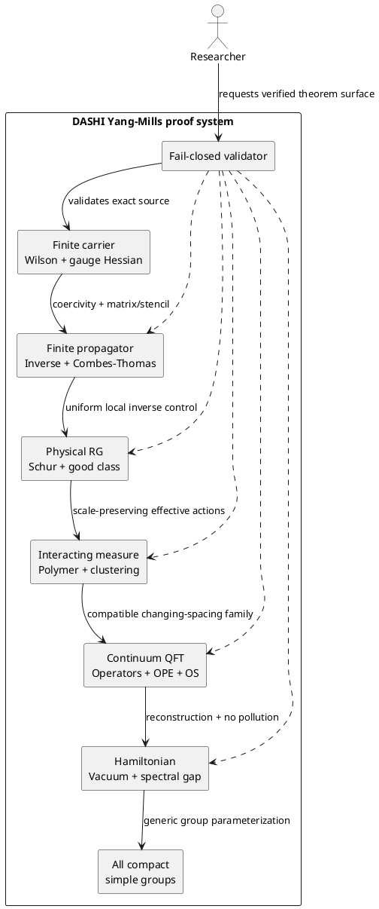

# Yang–Mills Clay Contract and Constructive Path — Round 32

Parent status page: [Current Gate Status](./CurrentGateStatus.md)

Domain index: [Yang–Mills Reference Index](./YangMillsReferenceIndex.md)

Formal owners:

- [Literal Clay problem contract](../../../DASHI/Physics/YangMills/YangMillsClayProblemContractExact.agda)
- [Gate preconditions, postconditions and invariants](../../../DASHI/Physics/YangMills/YangMillsConstructivePathPrePostInvariantExact.agda)
- [Literal quaternion scalar budget](../../../DASHI/Physics/YangMills/BalabanStrongCouplingLiteralQuaternionScalarBudgetExact.agda)
- [Literal Hessian coefficient assembly](../../../DASHI/Physics/YangMills/BalabanStrongCouplingLiteralHessianBudgetAssemblyExact.agda)
- [Cumulative validation root](../../../DASHI/Physics/YangMills/BalabanClayHighestAlphaRound32ClayContractValidation.agda)

## Decision

The repository has **not** implemented a complete Clay solution. It has implemented enough exact finite algebra, typed boundaries and constructive-QFT interfaces to state a precise path and identify the first missing producer at every transition.

The literal completion target is:

1. for every compact simple gauge group;
2. construct a nontrivial quantum Yang–Mills theory on four-dimensional spacetime;
3. construct local quantum operators corresponding to gauge-invariant local polynomials in the curvature and its covariant derivatives;
4. prove the required short-distance agreement with asymptotic freedom and perturbative renormalization, including the expected stress tensor and operator-product expansion;
5. satisfy an accepted axiomatic QFT scheme at least as strong as the cited Wightman/Osterwalder–Schrader formulations;
6. reconstruct a positive self-adjoint Hamiltonian with a vacuum sector and positive energy; and
7. prove a finite strictly positive spectral gap above that vacuum.

A fixed-lattice Hessian, finite propagator, fixed-spacing thermodynamic theorem, all-beta lattice gap, or continuum OS interface is a useful intermediate theorem but is not this conclusion.

## Updated plan and roadmap

**Imperative:** reduce the live Yang–Mills proof graph by closing mathematical producers in dependency order. Do not add another terminal receipt and do not promote a downstream result while an upstream witness remains open.

- [x] Frame the round around the literal Clay conclusion rather than a finite proxy.
- [x] Assign disjoint lanes: source contract, finite atom mathematics, constructive path, and documentation/validation.
- [x] Close the previously unwired scalar-atom budget into the exact source coefficient `8(d-1)`.
- [x] Give every highest-alpha gate explicit preconditions, postconditions and invariants.
- [x] Add the official local-curvature-operator, asymptotic-freedom, stress-tensor and OPE requirements.
- [ ] Obtain an observed Agda 2.9 kernel result for the cumulative root.
- [ ] Prove the selected-background link-radius producer.
- [ ] Prove the correlated selected-background Wilson lower bound.
- [ ] Instantiate the literal finite Hessian matrix, inverse and Combes–Thomas theorem.
- [ ] Prove one physical scale-uniform RG step.
- [ ] Construct the interacting measure, thermodynamic and changing-spacing ultraviolet limits.
- [ ] Construct continuum local operators and prove short-distance asymptotic-freedom/OPE matching.
- [ ] Verify continuum OS axioms, nontriviality and vacuum-compatible spectral transfer.
- [ ] Parameterize the completed construction for every compact simple group.

Refinement continues only when at least one of these quality metrics improves materially:

- one open physical producer becomes an exact theorem;
- one conditional endpoint receives its real physical inputs;
- one gate boundary gains an exact interface equality;
- one validation blocker is replaced by an observed kernel result;
- or one circular dependency is removed from the accepted input set.

## ZKP-style orchestration frame

| Field | Round-32 value |
|---|---|
| O — Organization | `chboishabba/dashi_agda`, Yang–Mills highest-alpha stack |
| R — Request | State and advance the literal Clay requirements without terminal promotion |
| C — Code | Exact rational-quaternion Hessian algebra plus typed constructive-QFT contracts |
| S — State | Finite/local mathematics advanced; continuum operators, construction and spectral transfer open |
| L — Lattice | Finite periodic carriers → uniform RG family → changing-spacing continuum |
| P — Proposal | Close gates in dependency order; retain separate selected-background and strong-coupling routes |
| G — Governance | Fail closed; source metadata; no postulates, holes, unsafe flags or proof-by-citation substitutes |
| F — Gap function | Physical survival requires `Delta_latt(beta(a)) >= m_* a`, equivalently `a^-1 Delta_latt >= m_* > 0` |

The zero-knowledge framing is organizational only: each lane exposes the smallest public witness needed by the next lane and does not expose or assume a downstream target as an upstream premise.

## Preconditions, postconditions and invariants

### Gate 0 — verified source head

**Preconditions:** cumulative branch and focused checker exist.

**Postconditions:** the complete root is accepted by the configured Agda kernel.

**Invariants:** no holes, postulates, unsafe escapes, trust primitives or imported theorem receipts.

### Gate I — selected-background terminal Hessian

**Preconditions:** actual selected background, regular gauge, block-average constraint, principal logarithm convention and physical tangent field.

**Postconditions:** selected-link radius and correlated Wilson lower bound imply the literal gauge-fixed constrained Hessian bound `H_A[h,h] >= (1/32)||h||^2`.

**Invariants:** gauge covariance, exact link orientation, the same perturbation field in every Hessian term, and no replacement of correlated plaquette control by independent link-radius estimates.

### Gate II — finite propagator

**Preconditions:** terminal coercivity, literal finite basis, complete matrix representation, exact stencil and row/column mass.

**Postconditions:** constructive inverse and exponential Green-kernel decay by the existing finite Combes–Thomas endpoint.

**Invariants:** Hermiticity, locality, exact carrier size, support graph, rational certificate integrity and no appeal to finite-dimensionality without an inverse construction.

### Gate III — physical uniform RG step

**Preconditions:** differentiated Schur identity, fluctuation coercivity, uniform inverse decay, block masses and signed remainder estimates.

**Postconditions:** the next effective action remains in the physical good class with strict loss contraction.

**Invariants:** gauge covariance, locality, reflection compatibility where required, constants independent of scale/volume/cutoff, and separate Schur/remainder budgets.

### Gate IV — interacting measure and clustering

**Preconditions:** physical RG good-class preservation plus small-field/large-field and polymer summability estimates.

**Postconditions:** normalized interacting finite-volume measures, volume-uniform clustering and boundary-condition control.

**Invariants:** positivity, normalization, locality, target clustering not assumed as an input, and source authority separated from in-repository proof.

### Gate V — thermodynamic and ultraviolet OS limit

**Preconditions:** compatible volume family, changing-spacing coupling trajectory, tightness/equicontinuity and uniform physical-scale estimates.

**Postconditions:** nontrivial continuum Schwinger functions; local gauge-invariant curvature operators; short-distance asymptotic-freedom, stress-tensor and OPE agreement; and the required OS axioms.

**Invariants:** gauge-invariant observable content, Euclidean covariance, reflection positivity, projective compatibility, physical gap scale, nontriviality and no use of the desired OPE/gap as an input estimate.

### Gate VI — Hamiltonian gap

**Preconditions:** OS reconstruction, compatible vacuum projectors and operator convergence strong enough to exclude spectral pollution.

**Postconditions:** a positive self-adjoint Hamiltonian with spectrum `{0} union [Delta,infinity)` for some finite `Delta>0`.

**Invariants:** vacuum compatibility, no spectral pollution below the margin, positivity and nontrivial local observables.

### Gate VII — all compact simple groups

**Preconditions:** the complete construction for a generic compact simple group, with every group-dependent constant and representation convention exposed.

**Postconditions:** the literal Clay conclusion for every compact simple gauge group.

**Invariants:** no SU(2)-specific quaternion identity is silently generalized; each group-specific analytic constant is proved or explicitly parameterized.

## Route separation

The selected-background route targets the finite propagator and then a scale-uniform RG theorem. The Shen–Zhu–Zhu route targets fixed-spacing strong-coupling LSI/Poincaré, uniqueness and clustering. They can share finite Lie-group and Wilson-action algebra, but neither route may borrow the other route's missing conclusion.

In particular, fixed-spacing strong-coupling clustering does not supply:

- the weak-coupling trajectory `beta(a) -> infinity`;
- a changing-spacing ultraviolet limit;
- continuum curvature operators or short-distance asymptotic-freedom/OPE matching;
- continuum OS axioms and nontriviality;
- or a reconstructed Hamiltonian mass gap.

## C4-style component view

## Quality, risk and service controls

The standards named for this round are applied as design controls, not claimed certifications.

- **ITIL / ISO 9001:** one change scope, named owners, traceable source-to-theorem links, acceptance criteria, nonconformance kept visible, and a separate verification phase.
- **ISO 42001 / ISO 23894 / NIST AI RMF:** claim-risk classification, fail-closed promotion, provenance, human review boundaries and explicit uncertainty.
- **ISO 27001 / ISO 27701:** no secrets or personal data in proof artifacts; dependency and workflow integrity are checked.
- **ISO 9241 family, ISO 24505, ISO 24552, ISO 16817 and ISO 22727:** plain-language headings, linear navigation, readable tables, text alternatives to the diagram and stable relative links.
- **Six Sigma:** critical-to-quality measures are kernel acceptance, zero forbidden proof escapes, exact gate-interface continuity, source metadata coverage and reduction of open physical producers.

## Verification phase

The focused verifier must run after all lanes are integrated:

1. cascade through Round 31;
2. check every new file exists;
3. reject holes, postulates, unsafe options, trust primitives and receipt substitutions;
4. check theorem names, source identifiers, exact contract counts, local-operator/OPE clauses and route-separation guards;
5. verify all seven adjacent gate interfaces are definitionally equal;
6. invoke the pinned Agda 2.9 cumulative root; and
7. report kernel/workflow state separately from static checks.

A static pass is not a kernel pass. The branch remains draft until an actual Agda result is observed.
