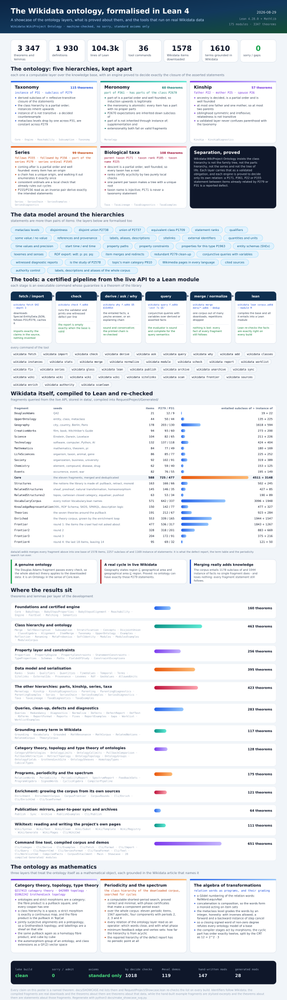

This project was edited by [Aristotle](https://aristotle.harmonic.fun).

To cite Aristotle:
- Tag @Aristotle-Harmonic on GitHub PRs/issues
- Add as co-author to commits:
```
Co-authored-by: Aristotle (Harmonic) <aristotle-harmonic@harmonic.fun>
```

# A Lean 4 formalisation of the Wikidata ontology

The library in `RequestProject/` formalises the ontology layer of Wikidata
(`Wikidata:WikiProject Ontology`): items, `instance of` (P31), `subclass of`
(P279), metaclass levels, properties and their constraints, ranks, disjointness,
mereology, kinship (`father` P22, `mother` P25, `spouse` P26), alternative
parenting (`parent` P8810, `stepparent` P3448, and the roles of adoption,
fostering, guardianship, surrogacy and gamete donation), series (`follows`
P155, `part of the series` P179), RDF, globe coordinates (`coordinate location`
P625) and the geographic containment they must respect, soft identity (`said to
be the same as` P460 versus `different from` P1889), the administrative
qualifiers of a constraint (`exception to constraint` P2303, `constraint status`
P2316, `constraint scope` P4680), the allowed-units constraint (Q21514353), and
much more — with certified executable engines for each layer.

## Start here: baby steps

[`RequestProject/BabySteps.lean`](RequestProject/BabySteps.lean) is a short,
self-contained tour of the model in numbered one-line steps: a four-item
fragment of Wikidata (Douglas Adams, human, person, and a metaclass) is built
by hand, its four obligations are discharged, and the basic facts — inheritance,
the failure of `instance of` to be transitive, who is an individual, a class or a
metaclass — are then derived. It depends only on `RequestProject.Core`.

[`RequestProject/BabyStepsProperties.lean`](RequestProject/BabyStepsProperties.lean)
is the sequel, in the same numbered style, for the *property* layer: a five-item,
four-property fragment (`spouse` P26 as a symmetric subproperty of `relative`
P1038; `part of` P361 transitive and inverse to `has part(s)` P527) is asserted
by hand, the derived statements are read off, and — using the minimality of the
derived statement relation — so are two things that do *not* follow: no statement
ever links a person to a place, and `part of` has no cycles. It depends only on
`RequestProject.Properties`.

## The ontology inside the ontology

Wikidata describes itself with its own vocabulary, and the development
formalises that move.  The **meta lift** re-reads every identifier as its own
meta-level name and the **reduction** reads meta names back; the two are a
retraction, so the meta copy is a conservative extension; the meta copy is also
a **pullback**; and the lift behaves like a **Frobenius** endomorphism, an
isomorphism onto the knowledge bases already written in meta-vocabulary.
[`docs/META.md`](docs/META.md) reviews the four notions and names the theorem
for each; the sources are
[`RequestProject/Reflection.lean`](RequestProject/Reflection.lean),
[`RequestProject/Renaming.lean`](RequestProject/Renaming.lean) and
[`RequestProject/MetaFrobenius.lean`](RequestProject/MetaFrobenius.lean).

## The mathematics the library is made of

Those constructions are ordinary mathematics, and Wikidata has an article for
each of them.  [`RequestProject/Vocabulary.lean`](RequestProject/Vocabulary.lean)
matches 32 of those articles — `pullback` (Q1397439), `retract` (Q2141963),
`monoid` (Q208237), `preorder` (Q1425985), `adjoint functor` (Q357858),
`partition of a set` (Q381060), `quotient set` (Q3966112), `well-founded
relation` (Q338021), … — with the constructions of this library that instantiate
them, and
[`RequestProject/MathResonance.lean`](RequestProject/MathResonance.lean) proves
each match in Mathlib's own vocabulary: a `Submonoid`, a `Preorder`, an
`IsStrictOrder`, a `GaloisConnection`, `IsIdempotentElem` with its
`Function.fixedPoints`, `Setoid.ker` with its quotient, a
`Set.PairwiseDisjoint` family.  Those same articles were then queried from
Wikidata into `data/structures.wdkb` and compiled, so what Wikidata says about
the notions can be compared with what the library proves about the
constructions ([`RequestProject/MathCorpus.lean`](RequestProject/MathCorpus.lean),
[`docs/MATH.md`](docs/MATH.md)).

## Topology, categories, types, groups and fields — around the pullback

The fibre product of two ontologies over a third is the operation that aligns
two vocabularies, and seven further theories are attached to it here.  Ontologies
and strict morphisms form a **category** in which the fibre product is a genuine
`IsPullback` square; a class hierarchy carries a **topology** (Alexandrov, of
`subclass of`) in which strict morphisms are exactly the continuous maps and the
matched pairs are the pullback of the item spaces in `TopCat`; jointly surjective
families of alignments form a **Grothendieck topology**, whose pullback-stability
axiom *is* the fibre product; **homotopy type theory** reads a matched pair as a
triple `(x, y, p : F x = G y)` and the projections as fibrations; **cubical type
theory** says a cube in the fibre product is a pair of cubes agreeing over the
reference ontology; **group theory** assembles a symmetry of the pullback out of
a compatible triple of symmetries; and **field theory** reads class extensions as
a `GF(2)`-vector space in which the pullback square becomes a square of linear
maps.  [`docs/THEORIES.md`](docs/THEORIES.md) reviews the seven layers and names
the theorem for each; the sources are
[`RequestProject/CategoryOfOntologies.lean`](RequestProject/CategoryOfOntologies.lean),
[`OntologyTopology.lean`](RequestProject/OntologyTopology.lean),
[`GrothendieckSite.lean`](RequestProject/GrothendieckSite.lean),
[`HomotopyTypes.lean`](RequestProject/HomotopyTypes.lean),
[`CubicalTypes.lean`](RequestProject/CubicalTypes.lean),
[`OntologyGroups.lean`](RequestProject/OntologyGroups.lean) and
[`OntologyFields.lean`](RequestProject/OntologyFields.lean), with the Wikidata
side in [`TheoryCorpus.lean`](RequestProject/TheoryCorpus.lean).

Two questions those layers leave open are settled in
[`OntologyLimits.lean`](RequestProject/OntologyLimits.lean) and
[`OntologySheaves.lean`](RequestProject/OntologySheaves.lean).  A strict morphism
is a **monomorphism** exactly when it is injective on items; the empty ontology
is an **initial object**; but there is **no terminal object** — a terminal
ontology would have a single item, and an item cannot be an `instance of`
itself — so the category has all pullbacks yet is not finitely complete.  And the
site of ontologies carries its first **sheaf**: for a fixed set of labels, the
labellings `X.carrier → S` form a presheaf, and a family of labellings over a
jointly surjective cover that agrees on fibre products glues to exactly one
labelling of the target.

The pullback and the retraction are developed further in
[`PullbackRetraction.lean`](RequestProject/PullbackRetraction.lean).  Fibre
products are **symmetric**, **associative** (an iterated fibre product is a
fibre product along the composite) and trivial along the identity; the fibre
product of two sub-vocabularies of one ontology is the sub-vocabulary of their
**intersection**; and monomorphisms are stable under base change.  On the
retraction side: retracts contain the isomorphisms and compose, a section is a
split monomorphism and its own kernel pair, **idempotents split** — so `Ont` is
an idempotent complete category and "retract" and "split idempotent" are the
same thing — and retracts are **stable under base change**, so a conservative
extension stays conservative after aligning it against a third ontology.  Two
worked examples close the file: merging a duplicated item is the splitting of an
idempotent, and thus loses nothing; while two classes with nothing said about
them are *not* a retract of the same two classes with a `subclass of` statement
between them, which also shows that a strict morphism can be a bijection on
items without being an isomorphism.

[`RetractTopology.lean`](RequestProject/RetractTopology.lean) reads the
retraction topologically: a retract of ontologies is a retract of item spaces —
the section is a topological **embedding**, under which specialization is exactly
the `subclass of` order of the small ontology, and the retraction is a
**quotient map**, though not always an open one.

## Extracting a module about a few items

Wikidata is too large to reason about whole, and the usual remedy is *module
extraction*: given a handful of items one cares about, keep the part of the
ontology that carries all the consequences about them.
[`RequestProject/Modules.lean`](RequestProject/Modules.lean) does that for the
executable engine.  `Wikidata.KB.moduleOf kb seeds` collects the items reachable
from the seeds along `subclass of` and `instance of` statements, with every
statement issuing from them, and it is proved to be

* **sound** — everything the module derives, the whole base derives
  (`moduleOf_isSubclassOf_le`, `moduleOf_isInstanceOf_le`);
* **conservative** — about an item it keeps, the module derives *exactly* the
  `subclass of` and `instance of` facts the whole base derives
  (`moduleOf_isSubclassOf`, `moduleOf_isInstanceOf`), so extraction loses nothing;
* **validity preserving** — a module of a validated base passes the validator
  (`moduleOf_valid`), hence is again an abstract ontology;
* monotone in the seeds, idempotent, and equal to the base itself when the seeds
  are all its items.

[`RequestProject/ModulesExamples.lean`](RequestProject/ModulesExamples.lean) runs
it on the worked fragment: the module about Douglas Adams keeps six of the seven
items and drops `film` together with the disjointness statement about it, while
still deriving that Douglas Adams is an entity.
[`RequestProject/ModulesCorpus.lean`](RequestProject/ModulesCorpus.lean) runs it
on the downloaded corpus of 1578 items: the module about *mathematics* (`Q395`)
has 279 items and 671 statements — a fifth of the corpus — and answers every
`subclass of` and `instance of` question about `Q395` exactly as the whole corpus
does.

## The command line tool

```
lake build wikidata
./.lake/build/bin/wikidata fetch Q42 --depth 3 --out douglas.wdkb
./.lake/build/bin/wikidata check douglas.wdkb
./.lake/build/bin/wikidata derive douglas.wdkb
./.lake/build/bin/wikidata why douglas.wdkb Q5 Q154954
./.lake/build/bin/wikidata query douglas.wdkb 'inst ?x Q5' --select x
```

`wikidata` downloads entities from the Wikidata API, keeps them in local files,
validates them, answers queries with variables against them, and constructs the facts they imply — each command backed by a
theorem of the library. See [`docs/CLI.md`](docs/CLI.md) for the full list and
what exactly is guaranteed, and run [`examples/demo.sh`](examples/demo.sh) for a
network-free tour.

```
./.lake/build/bin/wikidata report data/*.wdkb --out docs/reports/corpus
```

`wikidata report` turns the validators into lists you can look at: a CSV with one
row per issue — which file, which layer, which error type, how severe, the
identifiers and their labels, and the status of the fix suggested for it — an
HTML page summarising the issues by error type, and an SVG bar chart of the
counts. The reports for the whole downloaded corpus are checked in under
[`docs/reports/`](docs/reports/README.md); [`docs/REPORTS.md`](docs/REPORTS.md)
explains the columns and the theorems behind them.

```
./.lake/build/bin/wikidata worklist data/*.wdkb --gaps --out docs/reports/worklist
```

`wikidata worklist` is the same findings arranged as **things to work on**: the
rows grouped by error type, by file, by layer and by kind of work, each grouping
written as a CSV table, an HTML page and an SVG chart, with one CSV per task and
an index that puts the biggest task first.  Every grouping is a *proved*
partition of the report (`Wikidata.Report.tasks_flatMap_perm`) — each issue lands
in exactly one task, so the counts add up — and a task is advertised as safe only
when every fix in it is one already proved to change no derived fact.  With
`--gaps` the tables also carry what is missing rather than wrong: items with no
`subclass of`/`instance of` statement, items no statement mentions, and classes
with nothing under them.  The generated worklist for the corpus is in
[`docs/reports/worklist/`](docs/reports/worklist/README.md).

```
./.lake/build/bin/wikidata repairs examples/defects.skb --out docs/repairs --out-base
```

`wikidata repairs` is the step after the worklist: for **every** flagged issue of
both layers — the ontology and the series layer — it
proposes the changes that would fix it — one to four readings of the defect, each
with the edits it would make and a sentence saying why — and marks the ones a
check certifies.  A candidate is recommended only when it removes the issue it
was raised for, adds no error and no warning the base did not already carry
(`Wikidata.KB.proven_no_regression`), and lowers the *repair debt*, the weighted
count of errors, warnings and statements (`Wikidata.KB.proven_scoreAfter_lt`).
Everything else — which half of a cycle to cut, whether to withdraw a
disjointness or a membership — is left for a person, and **nothing is applied**:
the review is written out as a CSV table, an HTML page and a plain text page for
a talk page, with the candidate base beside it to diff against.  Applying any
selection of the recommendations is safe, because each is re-checked as it is
applied (`Wikidata.KB.applyProposals_errors_subset`, `applyProposals_valid`), and
a base with nothing wrong is a fixpoint: no candidate is proposed and no
statement is touched (`Wikidata.KB.autofix_eq_self_of_clean`).  The generated
reviews are in [`docs/repairs/`](docs/repairs/README.md);
[`docs/REPAIRS.md`](docs/REPAIRS.md) explains the workflow and the theorems,
and `scripts/make-repairs.sh` regenerates them.

## Wikidata facts, compiled to Lean

```
./.lake/build/bin/wikidata merge data/*.wdkb --dedup --out corpus.wdkb
./.lake/build/bin/wikidata lean corpus.wdkb --module RequestProject.Generated.Corpus
```

`wikidata lean` compiles a downloaded knowledge base into an ordinary Lean
module: the statements, the facts they entail, and proofs that the list of facts
is exactly right. `data/*.wdkb` holds the fragments queried from Wikidata (a
merged corpus of 588 items and 1202 statements, entailing 4511 `subclass of` and
3148 `instance of` facts), `RequestProject/Generated/` the compiled modules, and
`scripts/refresh-corpus.sh` re-runs the whole pipeline. What the compiled data
says about the real ontology — including a genuine `subclass of` cycle in live
Wikidata — is described in [`docs/CORPUS.md`](docs/CORPUS.md) and proved in
[`RequestProject/CompiledFacts.lean`](RequestProject/CompiledFacts.lean).

A crawl of bounded depth stops somewhere, and the corpus mentioned 144 items it
said nothing about.  `data/frontier.wdkb` asks Wikidata about exactly those
items, and
[`RequestProject/CorpusFrontier.lean`](RequestProject/CorpusFrontier.lean) proves
what was missing: only one of the 144 is a genuine root of the hierarchy, and
131 of them become subclasses of *entity* (Q35120) only once the missing layer is
downloaded — while the extended corpus still derives everything the old one did.
Three further rounds (`data/frontier2.wdkb` … `data/frontier4.wdkb`) shrink the
frontier again — 144 items, then 70, then 42, then 18, and 14 left after the
last round — each of them proved to lose nothing
([`RequestProject/CorpusRounds.lean`](RequestProject/CorpusRounds.lean)).
Two further downloads, `data/vocabulary.wdkb` and `data/related.wdkb`, cover the
notions the library only *named*: of the 156 Wikidata items its two vocabulary
tables mention, 89 had never been queried, and now every one of them is declared
by a downloaded fragment
([`RequestProject/RelatedNotions.lean`](RequestProject/RelatedNotions.lean)).

## Growing the ontology from its own sources

```
./.lake/build/bin/wikidata sitelinks Q42989 Q217413 --out sitelinks.tsv
./.lake/build/bin/wikidata scan Q42989 Q217413 --langs en,de,fr --out theories.scan
./.lake/build/bin/wikidata frontier theories.scan --base data/theories.wdkb --top 10
./.lake/build/bin/wikidata enrich theories.scan --base data/theories.wdkb --top 80
```

The corpus above was assembled by hand.  `wikidata sitelinks / scan / frontier /
sources / enrich` is the automatic version of that loop: pull every Wikimedia
page of an item **in every language**, reduce each article to the items it links
to, the properties of its Wikidata item and the sources it cites, **rank** what
the scan points at and the library does not have, then download the most
referenced of them and absorb them.  Each stage is a Lean function with a proof:
enrichment invents nothing and loses nothing (`KB.enrich_wellFormed`,
`KB.enrich_entails`, `KB.enrich_provenance`), the rankings are what they claim
(`Enrichment.mem_termDemand_iff`, `termDemand_head_max`), the loop makes progress
(`termDemand_absorb`, `frontier_isEmpty_iff_closed`, `State.step_entails`), and a
scan written to disk reads back unchanged (`Cli.parseScan?_renderScan`).

The first run, over the seven theories above, pulled 311 sitelinks over 135
sites, scanned 76 documents in ten languages — 51 articles and 25 external
sources found by following the citations — and found 4191 mentions and 1748
citations.  It named the most referenced missing term (*algebraic geometry*,
Q180969, in 27 of the 76 documents), grew the corpus from 191 to 553 items
conservatively, and asked for two new predicates, `is the study of` (P2578) and
`topic's main category` (P910), which
[`RequestProject/FieldsOfStudy.lean`](RequestProject/FieldsOfStudy.lean) now
supplies.  Every number is a theorem in
[`RequestProject/EnrichmentCorpus.lean`](RequestProject/EnrichmentCorpus.lean);
[`docs/ENRICHMENT.md`](docs/ENRICHMENT.md) is the full story and
`scripts/enrich.sh` re-runs it.

## Everything grounded in Wikidata

```
./.lake/build/bin/wikidata gloss Q64 P279
python3 scripts/fetch_glossary.py          # re-download the glossary
```

Every Wikidata identifier this project names — 1610 of them, 51 properties and
1559 items — is looked up in Wikidata itself and recorded with its label,
description and English Wikipedia article in
[`RequestProject/Generated/Glossary.lean`](RequestProject/Generated/Glossary.lean)
(readable versions: [`docs/GLOSSARY.md`](docs/GLOSSARY.md) and
`data/glossary.tsv`).  The notions the formalisation *defines* are grounded too:
[`RequestProject/Vocabulary.lean`](RequestProject/Vocabulary.lean) pairs 174 of
its declarations with the Wikidata entity each one formalises.

[`RequestProject/Grounded.lean`](RequestProject/Grounded.lean) checks all of it
in Lean: the glossary is well formed, so each identifier has exactly one meaning
(`lookup_unique`); every item of every downloaded fragment and of every
hand-built ontology of the library has an entry (`corpus_covered`,
`handwritten_covered`); and every notion of the vocabulary is grounded in an
entity carrying exactly the label claimed for it (`vocabulary_grounded`).

## The pages and the templates

```
./.lake/build/bin/wikidata wiki templates
./.lake/build/bin/wikidata wiki import pages/Wikidata_WikiProject_Ontology.wiki
./.lake/build/bin/wikidata wiki pages --out pages
./.lake/build/bin/wikidata wiki expand Q Q5
```

[`Wikidata:WikiProject Ontology`](https://www.wikidata.org/wiki/Wikidata:WikiProject_Ontology)
— the page this project set out to formalise — is itself formalised: its
wikitext is stored in
[`pages/Wikidata_WikiProject_Ontology.wiki`](pages/Wikidata_WikiProject_Ontology.wiki)
and parsed while Lean elaborates
[`RequestProject/Wiki/Pages.lean`](RequestProject/Wiki/Pages.lean), which proves
that the parsed page prints back to the file character for character, that it is
hygienic, and that every template it calls is one of the eight documented in
[`RequestProject/Wiki/Registry.lean`](RequestProject/Wiki/Registry.lean) — each
of which carries a machine-checked proof that it is a valid template.  Wikitext
is written *as wikitext* thanks to the `wiki!`, `template!` and `wikipage!`
macros of [`RequestProject/Wiki/Syntax.lean`](RequestProject/Wiki/Syntax.lean),
and new pages are produced from the formalised ontology by a generator whose
output is proved to round-trip.  [`docs/TEMPLATES.md`](docs/TEMPLATES.md) is the
reference for all of it.

## The terms of the corpus, and the periodicity search

```
python3 scripts/fetch_kb_terms.py          # download the terms of the corpus
```

Besides its statements, every Wikidata entity carries *terms*: labels,
descriptions and aliases.  `scripts/fetch_kb_terms.py` downloads all of the
English terms of **every entity of the downloaded corpus** — 1580 entities, all
labelled, 1519 described, with 3515 aliases — into `data/kb-terms.tsv` and
[`RequestProject/Generated/KbTerms.lean`](RequestProject/Generated/KbTerms.lean),
where they become a `TermStore`, the structure the term layer of
[`Terms.lean`](RequestProject/Terms.lean) is about.
[`RequestProject/KbTerms.lean`](RequestProject/KbTerms.lean) re-checks them:
every item of the corpus carries a label, Wikidata's label/description
**uniqueness constraint holds**, no alias repeats its own item's label — and
labels still do not identify items, since two items of the corpus are both
labelled *element*.

Those two items are on a `subclass of` **cycle**, which is what the second new
layer looks for.  A cycle is a *periodic point* of the class hierarchy, and
[`RequestProject/Periodicity.lean`](RequestProject/Periodicity.lean) develops
the search for them: walks of exactly `n` steps and their computed form, the
search `periodOf` for the shortest cycle through a point (sound, minimal and
complete up to its bound), the return times of a point and their closure under
addition, and the *period* of a point in the sense of Markov chains — the
numbers dividing every return time — which is proved to be an invariant of the
strongly connected component rather than of the point.  A **phase certificate**
gives the direction a search cannot: if every step inside a component advances a
`ZMod d`-valued phase by one, then every cycle through it has length divisible
by `d`.

[`RequestProject/PeriodicityReport.lean`](RequestProject/PeriodicityReport.lean)
runs the search over the 1578 items of the corpus: **eleven items are periodic**
and 1567 are not; they are exactly the items the defect report's cycle detection
finds, but now with a period each — *region* and *geographical area* with period
2, the four-item *scientist* component with period 4, the three items for
*element* with period 3, *delict* and *violation of law* with period 2 — each
period certified in both directions, so that (for instance) a `subclass of` walk
returns to *scientist* after exactly the positive multiples of four steps.  The
four deletions proposed by the defect report leave a hierarchy with no periodic
point at all.  [`docs/PERIODICITY.md`](docs/PERIODICITY.md) is the full account.

The search along `subclass of` is only one transition system, and
[`RequestProject/RelationWords.lean`](RequestProject/RelationWords.lean) makes
every relation of the ontology layer into an operator: a **word** in the letters
`subclass of` and `instance of` computes exactly the property path it spells,
and along such a word the metaclass level rises by the number of `instance of`
letters — so in a genuine ontology **no word using `instance of` can close**.
[`RequestProject/SpectrumReport.lean`](RequestProject/SpectrumReport.lean) runs
the search over the fourteen words of length at most three: raising the bound
to a hundred finds no twelfth periodic item, `instance of` alone closes at one
item — *variable-order class* is **an instance of itself** — and the mixed words
close at nine and eight items respectively, none of them on a `subclass of`
cycle.  Those mixed cycles survive the repair of the defect report, so the
repaired corpus, acyclic as its hierarchy is, still has **no model as an
abstract ontology**.  The mixed component also separates the shortest return
from the period: *Wikidata entity* returns after three steps, yet its component
has fundamental period one, and so carries no non-trivial phase.
[`RequestProject/FeedbackSets.lean`](RequestProject/FeedbackSets.lean) measures
the distance to acyclicity instead of merely detecting it: the **minimum
feedback edge set and the minimum feedback vertex set both have exactly four
elements**.  Laid against the term layer, three of the eleven periodic items
share their English label with another item, against 55 of the 1578 items of the
corpus.  [`docs/SPECTRUM.md`](docs/SPECTRUM.md) is the full account.

## The transformations, as an algebra

[`RequestProject/ProgramAlgebra.lean`](RequestProject/ProgramAlgebra.lean) reads
the words in `subclass of` and `instance of` as *programs* acting on the items,
and asks what algebra they carry.  They are numbers: the Gödel numbering
`RelWord.equivNat : List Link ≃ ℕ` in bijective base 2 is a bijection between
words and `ℕ`.  They compose: concatenation of words is composition of operators
(`KB.wordStep_append`).  They are graded: the count of `instance of` letters is a
homomorphism to `(ℤ, +)` and is the metaclass level displacement in any ontology,
so a closed walk has degree zero.
[`RequestProject/SignedWords.lean`](RequestProject/SignedWords.lean) makes the
grading honest by allowing each letter to run backwards, as an inverse property
path: a forward and a backward `instance of` step cancel.
[`RequestProject/CyclicAlgebra.lean`](RequestProject/CyclicAlgebra.lean) computes
the periodicity exactly where it is visible: the eleven items on a `subclass of`
cycle carry a **permutation of order exactly twelve**, and
[`RequestProject/CompilerPipeline.lean`](RequestProject/CompilerPipeline.lean)
shows each stage of the repair is a morphism of these transformation algebras
that answers every derived question the same way.
[`docs/PROGRAM-ALGEBRA.md`](docs/PROGRAM-ALGEBRA.md) lays this out rung by rung —
and is explicit that no quaternionic, octonionic, Clifford or Bott structure is
obtained, and that the twelve is a least common multiple of four cycle lengths
in one dataset with no proved relation to any periodicity theorem.

## One file you can host: the single page report

```
lake build wikidata
./.lake/build/bin/wikidata onepage data/*.wdkb --out site/report.html
```

writes [`site/report.html`](site/report.html): **one** HTML file carrying the whole
corpus, the whole diagnostics table, a query engine, SVG charts and a PNG export,
with no server, no build step, no network and no second file.  Pick an ontology,
type a query (`inst ?x Q5`, `sub ?x Q35120`, `class ?x`, …, one atom per line), read
the answers, chart them, download the drawing as SVG or PNG, and copy a link that
reproduces the view.

What the file contains is covered by theorems: reading an ontology back out of the
page returns exactly the ontology that was published
(`OnePage.parseJsonl?_blockPayload_dataBlock`, `OnePage.parseDocs?_sanitize_docs`),
the embedded data cannot escape its element (`OnePage.scriptSafeB_sanitize`) and
that precaution changes nothing (`OnePage.sanitize_eq_self`), the diagnostics read
back as written (`Report.parseCsvText_csvText`), and the charts count what they
claim (`OnePage.corpusBars_count_sum`, `OnePage.kbBars_count_sum`).  The engine
*in the browser* is JavaScript, so it is checked rather than proved: the page ships
query answers computed by the certified evaluator and digests of charts drawn by
the certified renderer, recomputes both on load, and says whether they agree — for
the committed report, 121 checks, all agreeing, the JavaScript renderer reproducing
the verified drawing character for character.

[`docs/ONEPAGE.md`](docs/ONEPAGE.md) is the guide; `scripts/make-onepage.sh`
regenerates the file and `node scripts/verify_onepage.js site/report.html` checks a
generated one headlessly.

## Publishing it: mirrors, peers and archives

The ontology is published, not just formalised.  One command builds the whole
site:

```
lake build wikidata
./.lake/build/bin/wikidata publish data/*.wdkb --out site
```

`site/` holds a page per ontology, the data as JSON Lines and in the project's own
format, a small JSON API, and `manifest.json` — every file with its length, its
digest and the content address of the ontology it carries.  The same directory is
deployed unchanged to **GitHub Pages** (`.github/workflows/pages.yml`), **Vercel**
(`vercel.json`), **Cloudflare Pages** (`wrangler.toml`), a **Hugging Face** dataset
and Space (`hf/`, `scripts/hf_sync.py`) and **Wikimedia Toolforge**
(`toolforge/`), mirrored over **IPFS and BitTorrent**
(`scripts/p2p_publish.sh`, `scripts/p2p_fetch.sh`) and deposited on
**archive.org** (`wikidata archive`, `scripts/archive_upload.sh`).  Every copy is
checked the same way — `python3 scripts/verify_site.py <dir>` recomputes each
length and digest — so no mirror, gateway or peer has to be trusted.

What is proved about the trip out of Lean and back:

* the published rows *are* the ontology — reading a published file back returns
  exactly the base that was published (`Publish.parseJsonl?_jsonlOfKB`), with one
  header row and one row per item, level and statement (`Publish.length_kbRecs`);
* the content address names the ontology: two clean bases with the same canonical
  text are equal (`Publish.eq_of_renderKB_eq`);
* replicas converge — after one round of gossip every replica agrees with every
  other (`KB.gossip_pairwise_equiv`) and none has lost anything
  (`KB.gossip_entails_all`), while syncing invents nothing, being the least upper
  bound for entailment (`KB.sync_least`);
* archives can be read back — a deposit re-imports to the base it was made from
  (`Archive.importKB?_bundleOf`), the public JSON Lines file alone suffices
  (`Archive.importKB?_rows_only`), and the deposit's manifest is honest
  (`Archive.checkManifest_bundleOf`).

[`RequestProject/PublishExamples.lean`](RequestProject/PublishExamples.lean) runs
all of it on the downloaded fragment about Douglas Adams, including two replicas
that drift apart and come back together; [`docs/PUBLISHING.md`](docs/PUBLISHING.md)
is the deployment guide.

## Status and showcase



[`docs/showcase.svg`](docs/showcase.svg) is a one-page tour of the whole thing:
the five hierarchies (taxonomy, meronomy, kinship, series, biological taxa) and
what is proved about each, the data model around them, the tool pipeline from
the live API to a re-checked Lean module, the twenty-two compiled fragments of
real Wikidata, where the theorems sit layer by layer, and the three layers that
treat the ontology itself as a mathematical object — its category, topology and
type theory; the periodicity of its class hierarchy; and the algebra of its
transformations.  [`docs/SHOWCASE.md`](docs/SHOWCASE.md) names the theorem
behind every claim on it, and [`docs/status.svg`](docs/status.svg) is the
shorter status report.  Both images are generated from the sources by the
scripts described in [`docs/README.md`](docs/README.md), and neither can drift:
every figure they show is counted from the repository, and the layer charts
refuse to draw if a module is left out or counted twice.

---

This project was edited by [Aristotle](https://aristotle.harmonic.fun).

To cite Aristotle:
- Tag @Aristotle-Harmonic on GitHub PRs/issues
- Add as co-author to commits:
```
Co-authored-by: Aristotle (Harmonic) <aristotle-harmonic@harmonic.fun>
```
